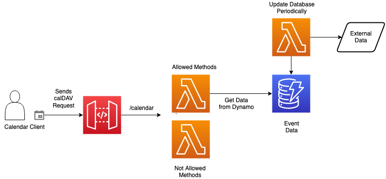

# CompCal
CompCal is a Serverless Calendar Server that allows users to subscribe to events in the Calendar.
It is not a full implementation of CalDAV, as there is no way of adding your own events or user managment.

## Architecture
CompCal is based on AWS Lambda and delivers the events as ics

## Deployment
This app is build using the AWS CDK, the Lambda functions, the DynamoDB Table and the API Gateway are deployed automatically using the CDK cli.

Step by step instructions:  
1. Set Up your AWS Credentials
2. Run npm install
3. Run cdk deploy